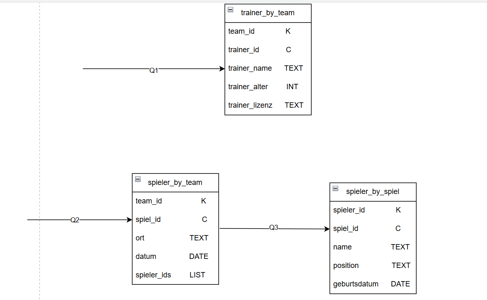

# Installation und Datenmodellierung für Cassandra

## A 

Nach sehr langem testen und probieren habe ich es endlich geschafft, das ich mich verbinden kann.

## B

[KN-C-01.drawio](KN-C-01.drawio)

Q1: Trainer eines Teams finden

Mithilfe dieser Abfrage können alle Trainer eines bestimmten Teams schnell gefunden werden.
Die Tabelle „trainer_by_team” ist speziell für dieses Abfragemuster konzipiert.
Durch die Verwendung der team_id als Partition Key werden alle Trainer eines Teams auf demselben Knoten gespeichert, was effiziente Abfragen ermöglicht.

Q2: Spieler eines Spiels finden

Mit dieser Abfrage können alle Spieler ermittelt werden, die an einem bestimmten Spiel teilgenommen haben.
Die Tabelle spieler_by_spiel ist für dieses Abfragemuster optimiert.
Die Spiel-ID als Partition-Key sorgt dafür, dass alle Spielerdaten eines Spiels auf demselben Knoten gespeichert werden.

Q3: Spiele eines Teams finden

Mit dieser Abfrage lassen sich alle Spiele eines bestimmten Teams schnell finden.
Die Tabelle Spiele_by_Team ist für dieses Abfragemuster konzipiert.
Mit team_id als Partition Key werden alle Spiele eines Teams zusammen gespeichert.
Das Feld „spieler_ids” (LIST<UUID>) ist ein Beispiel für die Denormalisierung in Cassandra, um Joins zu vermeiden.

## C

[KN-C-01_C.sql](KN-C-01.sql)