# Datenabfrage und -Manipulation

## A 
### [KN-C-02_hinzufügen.cql](cassandra_hinzufuegen.cql)

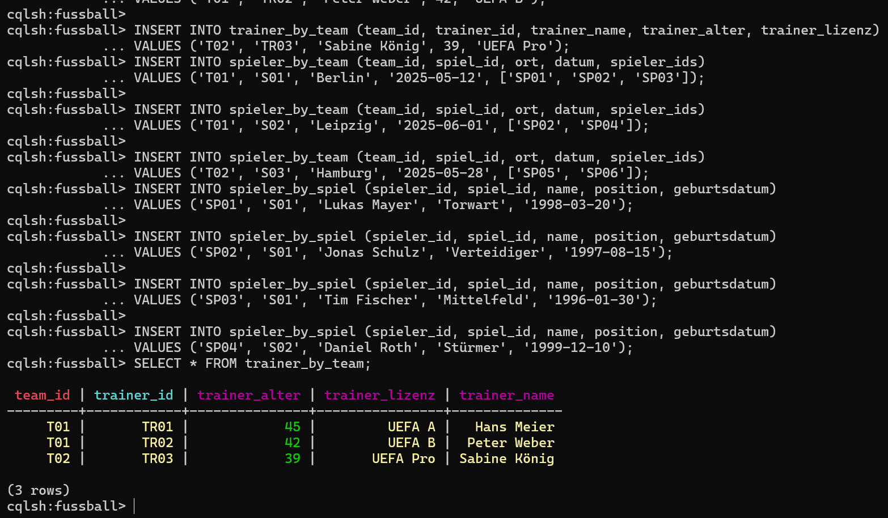

## B
### [KN-C-02_abfragen.cql](cassandra_abfragen.cql)

## 4 Szenarien
### Szenario NR.1
Hier werden alle Datensätze der Tabelle `trainer_by_team` abgefragt, die dem Team mit der ID `T01` zugeordnet sind. So kannst du sehen, welche Trainer für dieses Team zuständig sind.
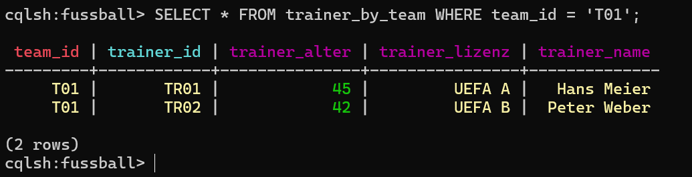

### Szenario NR.2
Diese Abfrage gibt alle Spiele zurück, an denen Spieler des Teams mit der ID `T02` beteiligt sind. Die Tabelle `spieler_by_team` enthält vermutlich Informationen darüber, welche Spieler an welchen Spielen für ein bestimmtes Team teilnehmen.
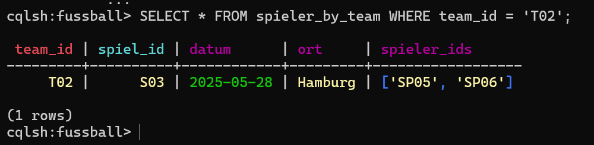

### Szenario NR.3
Mithilfe dieser Abfrage werden alle Spieler aufgelistet, die im Spiel mit der ID `S01` gespielt haben. Die Tabelle `spieler_by_spiel` ordnet Spieler ihren Spielen zu.
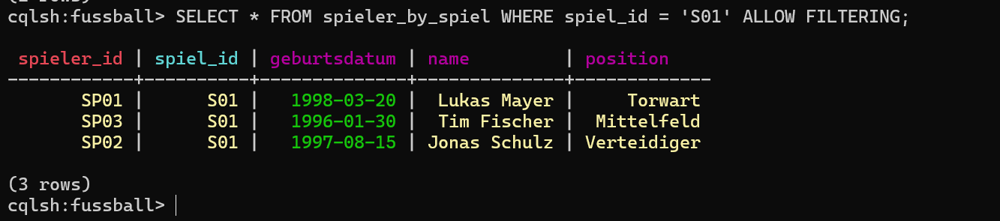

### Szenario NR.4
Mithilfe dieser selektiven Abfrage werden für das Spiel `S03` nur die Felder `Name`, `Position` und `Geburtsdatum` der Spieler zurückgegeben, um gezielt relevante Spielerinformationen zu erhalten.
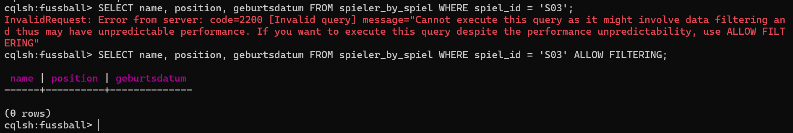

## C
### [KN-C-02_löschen.cql](cassandra_loeschen.cql)

### Daten löschen mit Partition- und Cluster-Key
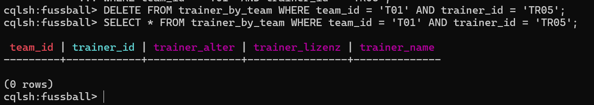

### Nur eine Spalte in einer Zeile löschen
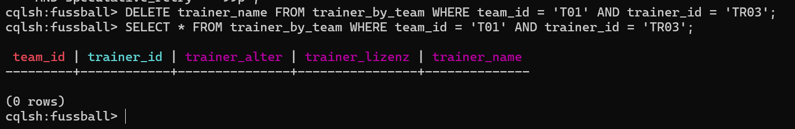

### Skript-Dateien erstellen
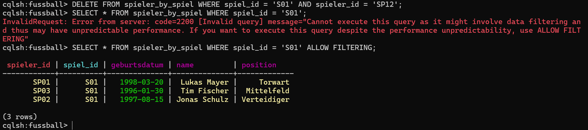

### Komplette Tabelleninhalte löschen
`trainer_by_team`
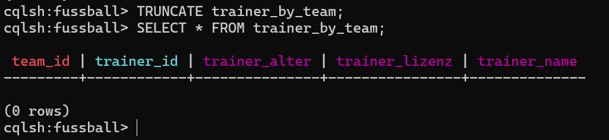

`spieler_by_team`
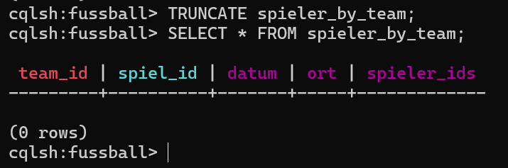

`spieler_by_spiel`
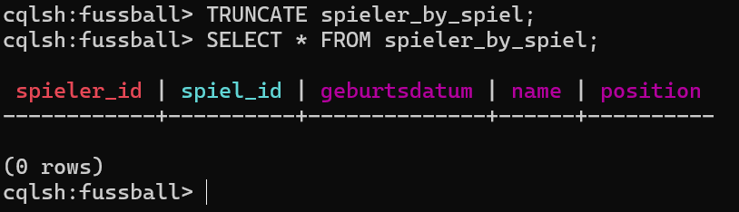

## D
### [KN-C-02_verandern.cql](cassandra_veraendern.cql)

## 3 Szenarien
### Szenario NR.1
Ein Trainer wird ausgetauscht. Für das Team T02 ersetzen wir den bisherigen Trainer mit der ID TR07 durch einen neuen Trainer namens `Jürgen Klopp`.
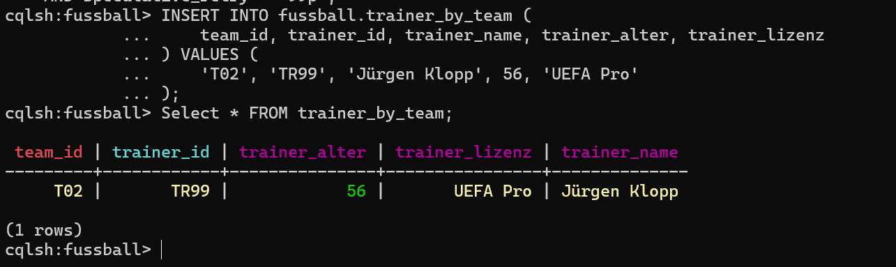

### Szenario NR.2
Der Spieler SP22 im Spiel S04 hatte eine falsche Position und ein falsches Geburtsdatum. Er wird nun als `Mittelfeldspieler` geführt und sein Geburtsdatum wurde auf den 21.05.2001 korrigiert.
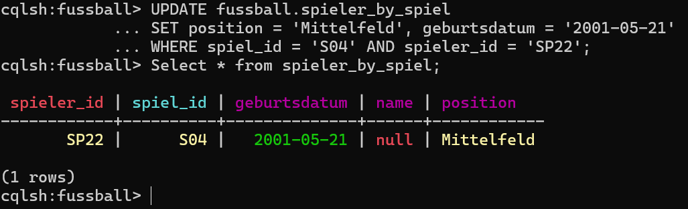

### Szenario NR.3
Das Spiel SP1001 für das Team T01 wurde von Berlin nach Leipzig verlegt. Das neue Datum ist der 01.11.2024.
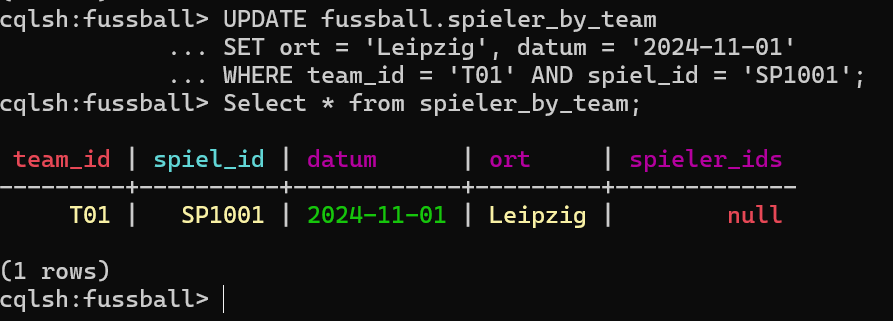