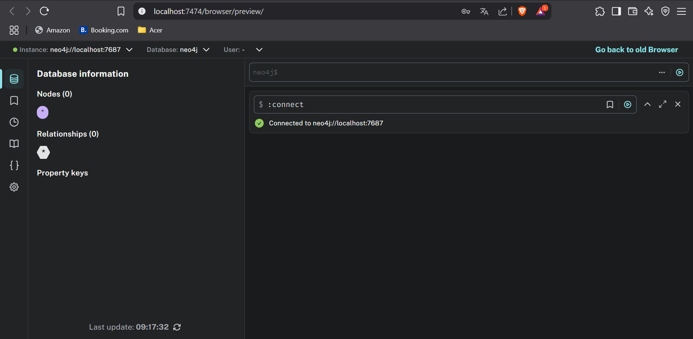
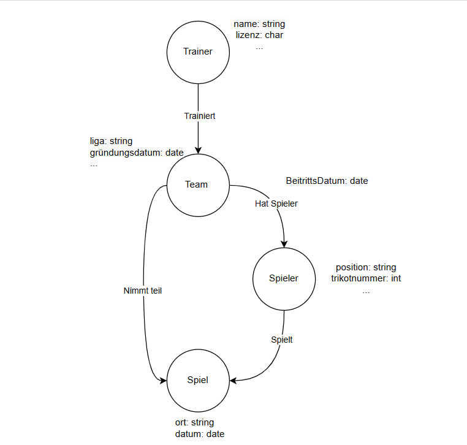

# Installation und Datenmodellierung für Neo4j

## A

## B

## [logischesNeo4j.drawio](logischesNeo4j.drawio)
- Trainer trainieren Teams.
- Teams bestehen aus Spielern.
- Teams nehmen an Spielen teil.
- Spieler können in diesen Spielen mitspielen.

Beziehungen (Relationships):

Trainiert
- Zwischen Trainer und Team
- Zeigt das ein Team ein Trainer hat.

Hat Spieler
- Zwischen Team und Spieler
- Attribut: BeitrittsDatum: date -> Zeigt, wann ein Spieler zu einem Team gewechselt ist.

Nimmt teil
- Zwischen Team und Spiel
- Zeigt das ein Team an einem Spiel teilnimmt.

Spielt
- Zwischen Spieler und Spiel
- Zeigt das ein Spieler an einem Spiel teilnimmt.