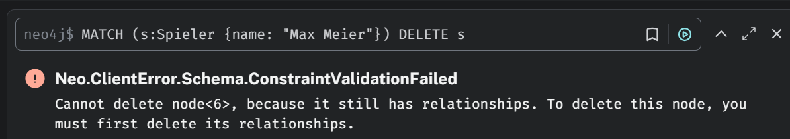
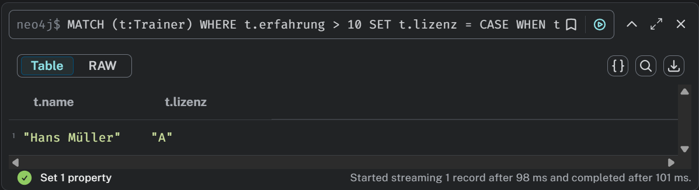

# Datenabfrage und -Manipulation

## Daten hinzufügen
### [KN-N-02_create.cypher](neo4j_create.cypher)


## Daten abfragen
### [KN-N-02_abfragen.cypher](neo4j_abfragen.cypher)


Dies zeigt alle Knotenpaare `(n → m)`, die durch eine gerichtete Beziehung `r` miteinander verbunden sind.

## 4 Szenarien
### Szenario NR.1
Wir wollen herausfinden, welche Spieler an Spielen teilgenommen haben, die in einer bestimmten Stadt, z. B. `Berlin`, stattfanden. Dabei geben wir auch das Datum des Spiels und die Position des Spielers zurück.


### Szenario NR.2
Finde alle Teams, die mindestens einen Spieler mit der Nationalität `Deutschland` im Kader haben. Gib auch das Beitrittsdatum aus.


### Szenario NR.3
Wir möchten alle Trainer mit ihren Teams anzeigen und dabei alle Spieler des jeweiligen Teams auflisten. Ein Team, das noch keine Spieler hat, soll trotzdem angezeigt werden.


### Szenario NR.4
Diese Abfrage kombiniert mehrere Bedingungen: Grösse des Spielers, Liga des Teams und Einsatz des Spielers in einem Spiel. Dies ist ein realistisches Szenario für Scouting- oder Statistiksysteme.


## Daten löschen
### [KN-N-02_löschen.cypher](neo4j_löschen.cypher)

`Ohne DETACH`
```
MATCH (s:Spieler {name: "Max Meier"})
DELETE s
```
Dieser Befehl schlägt fehl, wenn der Spieler `Max Meier` noch mit einem Team verbunden ist oder bereits an Spielen teilgenommen hat.

`Mit DETACH DELETE`
```
MATCH (s:Spieler {name: "Max Meier"})
DETACH DELETE s
```
Mit diesem Befehl werden alle eingehenden und ausgehenden Kanten von `Max Meier` automatisch gelöscht.
[:SPIELT]-Beziehungen zu Spiel
[:HAT_SPIELER] vom Team

`Vorher`


ohne DETACH


Mit DETACH


`Nacher`


## Daten verändern
### [KN-N-02_verändern.cypher](neo4j_verändern.cypher)

## 3 Szenarien
### Szenario NR.1
Trainer mit mehr als zehn Jahren Erfahrung sollen ein Lizenz-Upgrade erhalten.
"B" → "A"
"C" → "B"
"A" bleibt unverändert


### Szenario 2
Alle Spieler, die vor 2021 zu einem Team gestossen sind, sollen das neue Feld `langzeitmitglied` mit dem Wert `true` erhalten. Diese Information gehört zur Beziehung `HAT_SPIELER`, nicht zum Spieler selbst.


### Szenario 3
Hat ein Team an einem Spiel in Berlin teilgenommen, soll sein Stadionname um `- Nordtribüne` erweitert werden (z. B. `Olympiastadion` → `Olympiastadion – Nordtribüne`). Dies betrifft den Knoten `Team`, aber bedingt über `Spiel-Orte`.


## Zusätzliche Klauseln
###  INSERT

Mithilfe von CREATE kannst du neue Knoten oder Kanten in der Datenbank erzeugen. Dabei kannst du alle gewünschten Eigenschaften direkt setzen.

```
CREATE (s:Spieler {
  name: "Leon Krämer",
  position: "Torwart",
  groesse: 190,
  nationalität: "Deutschland"
})
```

### DELETE / DETACH DELETE

1. DELETE löscht einen Knoten oder eine Beziehung, nur wenn dieser keine Verbindungen mehr hat.
2. DETACH DELETE löscht den Knoten inkl. aller Beziehungen – also vollständig

Bsp 1: 
```
MATCH (s:Spieler {name: "Leon Krämer"})
DELETE s
```

Bsp 2: 
```
MATCH (s:Spieler {name: "Leon Krämer"})
DETACH DELETE s
```