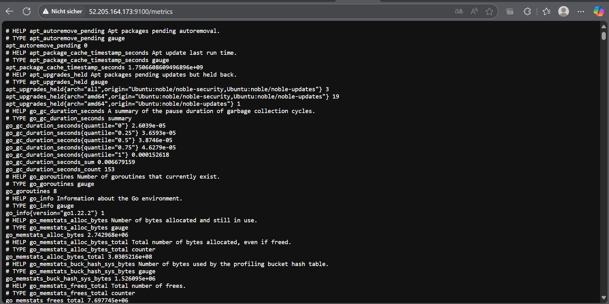
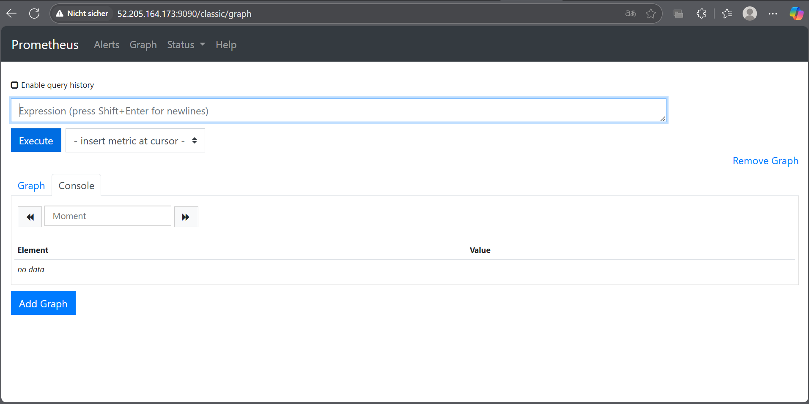
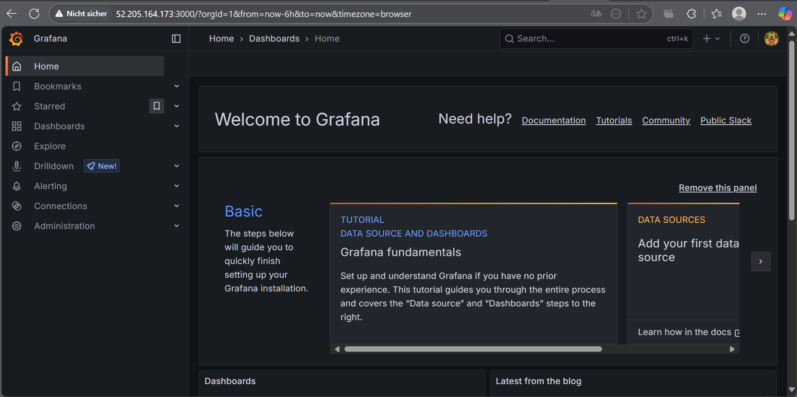
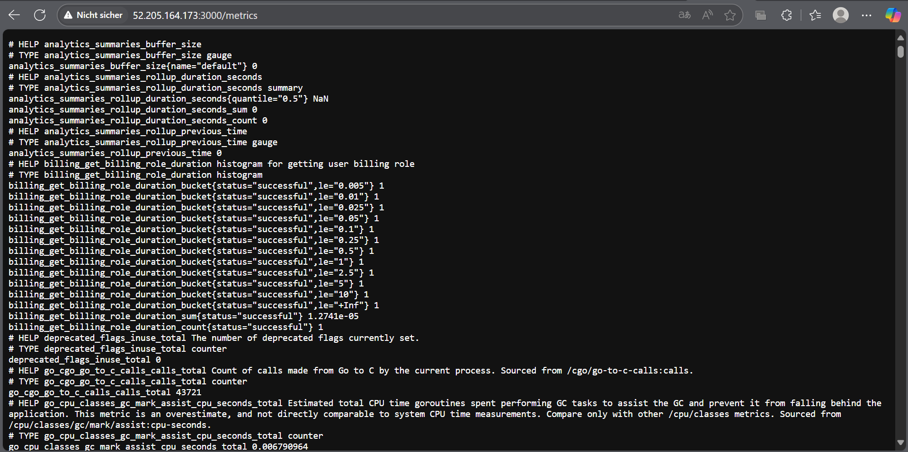
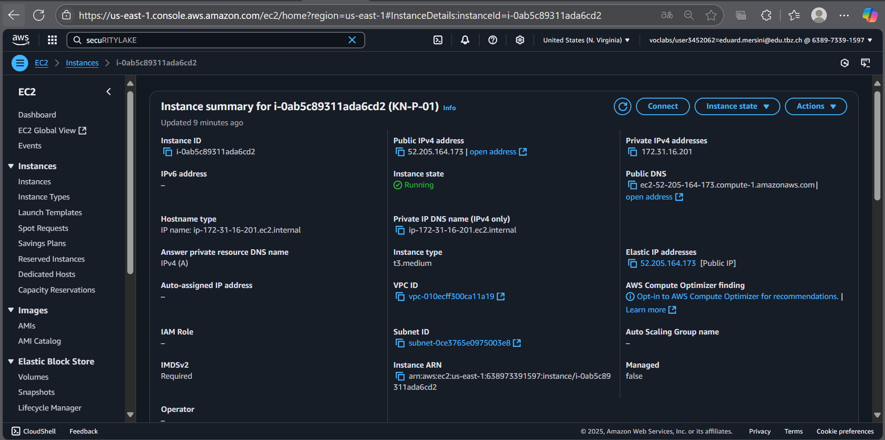

# Installation von Prometheus und Grafana

## A

`Prometheus Node-Exporter Metrics:
http://<Ihre-IP>:9100/metrics`

`Prometheus Dashboard:
http://<Ihre-IP>:9090`

`Grafana Dashboard:
http://<Ihre-IP>:3000`

`Grafana Metrics für Prometheus
http://<Ihre-IP>:3000/metrics`

`AWS Instance with Static IP`

## B

`1. Was sind Scrapes in Prometheus?`
Scrapes sind automatische Abrufe von Metriken durch Prometheus. Prometheus ruft dabei in regelmässigen Intervallen (z. B. alle 15 Sekunden) bestimmte HTTP-Endpunkte ab, um aktuelle Metrikdaten im Prometheus-Format zu erhalten.

🔹 Beispiel:
Du hast eine Node-Exporter-Instanz laufen, die Systemmetriken unter http://192.168.0.10:9100/metrics zur Verfügung stellt.
In deiner prometheus.yml steht dazu folgender Scrape-Abschnitt:

#### [KN-P-01_Beispiel.yaml](Beispiel.yaml)

`2. Was sind Rules in Prometheus?`
Rules sind Regeln zur Verarbeitung von Metriken.

🔹 Beispiel – Alerting Rule:
In deiner rules.yml definierst du einen Alarm, der ausgelöst wird, wenn ein Node nicht erreichbar ist.

#### [KN-P-01_Beispiel.yaml](Beispiel.yaml)

`3. Wie speichert man eigene Daten in Prometheus?`
🔹 Schritte:
1. Eigene Anwendung vorbereiten, die Metriken bereitstellt (z. B. per HTTP-Endpoint /metrics).
2. Verwende Prometheus Client Libraries (z. B. in Python, Go, Java).
3. Richte den HTTP-Endpunkt ein, der Metriken im Prometheus-Format zurückgibt.
4. Konfiguriere in prometheus.yml einen neuen Scrape-Job für deine Anwendung.
5. Starte Prometheus neu (oder lade Konfiguration neu).

`4. Welche Variablen werden in Scrapes und Rules verwendet?`
🔹 In Scrapes:
- job_name: Name des Jobs (frei wählbar)
- targets: Liste der Ziel-URLs/Ports
- Weitere: metrics_path, scheme, basic_auth, etc.

🔹 In Rules:
- Variablen aus Metriken wie:
    - up
    - node_cpu_seconds_total
    - http_requests_total
- Labels: instance, job, mode, etc.
- Kommen von den gescrapten Endpunkten – z. B. /metrics auf Port 9100 (Node Exporter) oder App-spezifisch.

`Woher kommen die Variablen?`
Sie werden dynamisch durch den Scraper aus den Endpunkten der Exporter gelesen. Die Labels stammen entweder von den Exportern selbst oder werden durch die Scrape-Konfiguration hinzugefügt.

`5. Wie erkennt Prometheus, ob ein System "up" ist?`
Prometheus verwendet die eingebaute Metrik up:
- Wenn ein Scrape erfolgreich war: up == 1
- Wenn das Ziel nicht erreichbar ist: up == 0
Diese Variable wird bei jedem Scraping-Vorgang automatisch generiert.