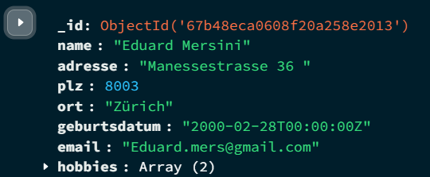

# Installation und Verwaltung von MongoDB

## A

authSource=admin bedeutet, dass die Anmeldeinformationen in der admin-Datenbank und nicht in der Standarddatenbank überprüft werden.
Dies ist sinnvoll, da Benutzer in MongoDB oft in der Admin-Datenbank angelegt werden, insbesondere wenn sie übergreifende Berechtigungen haben.
Ohne diese Angabe würde MongoDB versuchen, den Benutzer in der Standarddatenbank zu authentifizieren, was in der Regel zu einem Fehler führt.

### sudo sed -i 's/#security:/security:\n  authorization: enabled/g' /etc/mongod.conf
Dieser Befehl aktiviert die Authentifizierung in MongoDB, indem er die auskommentierte Zeile #security: ersetzt und die Option authorization: enabled hinzufügt.
Damit wird festgelegt, dass sich Benutzer mit gültigen Anmeldedaten authentifizieren müssen, um auf die Datenbank zugreifen zu können.

### sudo sed -i 's/127.0.0.1/0.0.0.0/g' /etc/mongod.conf
Dieser Befehl ändert die Bind-Adresse von 127.0.0.1 auf 0.0.0.0, damit MongoDB Verbindungen von externen Hosts akzeptiert und nicht nur lokal erreichbar ist.

## B

### Datentyp
Zuerst habe ich es als String übergeben, da es sowieso nicht anders erkannt wurde. Als ich es aber korrekt als Datum angeben wollte, musste ich erst googeln, wie man es richtig schreibt - denn es gibt eine spezielle Schreibweise: Zuerst kommt das Jahr, dann der Monat und dann der Tag.

## C

show dbs:
- Zeigt eine Liste aller vorhandenen Datenbanken in MongoDB an.

show databases:
- Macht das Gleiche wie show dbs.

use Ihre-Datenbank:
- Wechselt zu der angegebenen Datenbank.

show collections:
- Zeigt alle Collections in der aktuellen Datenbank an.

show tables:
- Macht das gleiche wie show collections.
