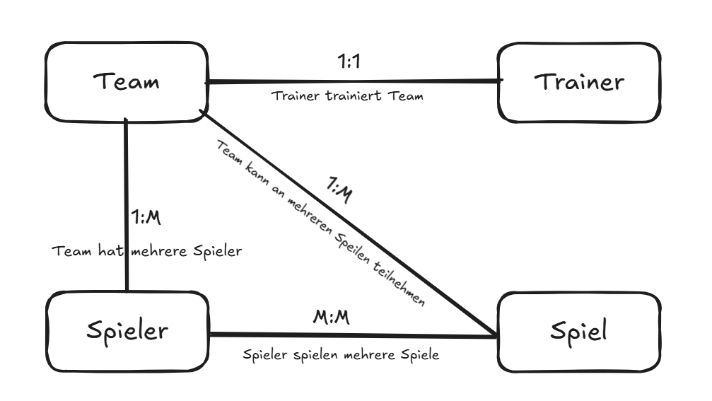
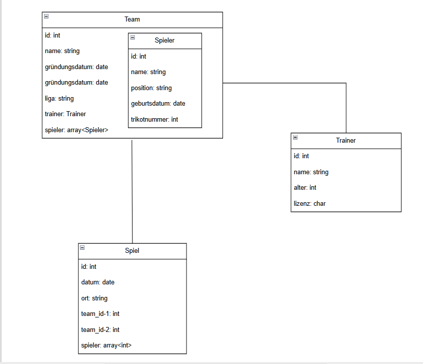

# Datenmodellierung für MongoDB

## A



Team und Spiel:
Ein Team kann an mehreren Spielen teilnehmen (1:M-Beziehung)

Team und Spieler:
Ein Team hat mehrere Spieler (1:M-Beziehung)

Team und Trainer:
Ein Team wird von einem Trainer trainiert (1:1-Beziehung)

Spieler und Spiel:
Spieler nehmen an mehreren Spielen teil (M:M-Beziehung)

## B 



## C


Das zeigt, was erstellt wurde, nachdem ich diesen Code ausgeführt habe.

```
use Fussballteam

db.createCollection("Team")
db.createCollection("Spiel")
```